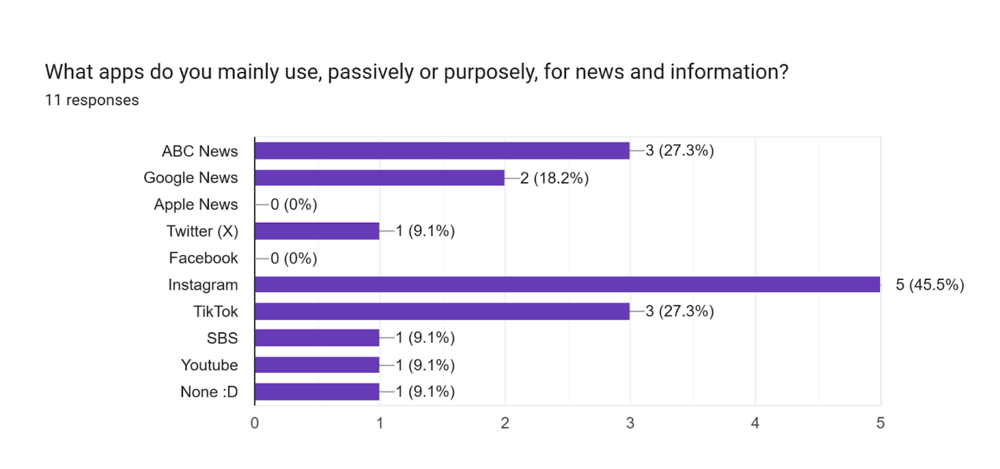

# TASK 2 - Web apps

## Identifying and Defining

### Divergent Thinking
| Idea Name                  | What it does                                                                                                                                                                                                                                                                   | Influence it explores               | Who it helps                                                                 |
|-----------------------------|-------------------------------------------------------------------------------------------------------------------------------------------------------------------------------------------------------------------------------------------------------------------------------|-------------------------------------|-------------------------------------------------------------------------------|
| Connection and Communication app | This app would essentially function the way that an ordinary messaging platform could work, where there is a mutual connection between two individuals and they are able to exercise their connection with a reliable and efficient communication app | People - Family and friends etc.    | People seeking connection between one or more other person through digital communication |
| Technology Usage Monitor    | This web app could monitor the usage of a person’s electronic devices to provide insight on their screen time habits, reciprocating a healthy relationship between them and their devices.                                                                                     | Technology as products for humans   | People who would like to minimise or generally manage their online activity for the sake of their own health/wellbeing |
| News web app                | This app will give a monthly overview in global news - it updates monthly to feature the most captivating and popular news stories around the world.                                                                                                                           | Society - News                      | People who prefer to stay updated on the status of global occurrences         |
| Personal journal app        | This app can log an individual’s journal entry and be saved under their account for later use. They can enter multiple journal entries.                                                                                                                                        | People - Feelings, values, behaviours | People who would like to be able to connect with themselves and channel their feelings into journal entries |
| Global forum                | This app will be able to input messages from all users and send them into a global forum for all to see and contribute to - just for the heck of it                                                                                                                             | People and their expressions in communication | Anyone!                                                                      |
| School news web app         | an app for the documentation of events at GHS                                                                                                                                                                                                                                 | Students and school                 | Students at gosford high school                                               |

### Convergent Thinking

#### Impact/Effort Matrix

#### SWOT Analysis

#### Reflection

A great way to look at things is to consider different perspectives on an influence-based web app as well as a personal evaluation of the impact/effort correlation. I would say that based on the effort and flexibility of the production of a news outlet I would choose it over a global chat forum, which would more than likely require so much more effort. While the global chat forum idea has a much more significant impact, it would require many new skillsets and this is kind of stress inducing under a 5-week timeframe. 

Therefore I select making a news outlet for my project.

### Requirements Outline

#### Functional Requirements
- Adequate user interface
    - users can view a list of news articles
    - users can search for news articles in the search bar
- Responsiveness
    - user can click any link and it takes them to the correct webpage
    - users can be viewing the web app from a variety of different devices and it responsively adjusts

#### Non-Functional Requirements
- Performance
    - Pages should be able to load very smoothly taking no more than 2 seconds
- Usability
    - Should have a sufficiently sized text for reading
    - Accessible font that is not hard to read

## Researching and Planning

### Exploring existing ideas
| App                  | Plus                                                                                                                                                                                                 | Minus                                                                                     | Implication                          |
|-----------------------|------------------------------------------------------------------------------------------------------------------------------------------------------------------------------------------------------|-------------------------------------------------------------------------------------------|--------------------------------------|
| ABC News              | Gives the user all kinds of insight on important things besides just news, e.g. weather, which is a more unique approach than other news websites  Displays news articles of all kinds of topics for the appeal of everyone - breaking news, sports, local-based news, politics, recipes etc  Gives you personalized use based on your approximate location within Australia  Responsive layout so that all device dimensions have a comfortable, usable appearance | Crowded interface, all the news briefs trying to be fit on one webpage  Not such an adequate use of space, the website margins squeeze the content into small spaces | Responsive Layout                    |
| New York Times        | Very traditional layout which can make it easier for a wider variety of audience to interpret/interact  Adequate contrast between the background and the text in a white-black scheme  Literally tells you the estimated time it would take to read an article at an average pace | Font can be a tad hard to read because it is squeezed                                        | Estimated time to read an article    |
| Sydney Morning Herald | “Helpful” site - instead of giving you all it has to offer and leaving you to find it autonomously, the website tries to help you find what you’re looking for.                                      | Crowded                                        | Complex search bar system                                                  |

### Secondary Research

News outlets earn the trust of people not by stating explicitly that they're trustworthy, but by behaving as if they are. When they report stories, the public assumes that journalists have checked facts, quoted accurately, and chosen stories in a responsible way. This unobtrusiveness builds credibility over time, with little regard to whether or not they actually provide good, honest news.

Research from the RIO (Reuters Institute, Oxford) suggests that younger people, people with low income and people without much formal education tend to trust the news less. The institute’s digital news report from 2021 shows:

#### IN TERMS OF AGE:
- 42% of people **over** the age of 35 trust the news stories coming their way
- ...while only 37% of people **under** the age of 35 trust the news.

#### IN TERMS OF INCOME:
- 36% of people with income in the **lower quartile (Q1)** trust the news they receive.
- 42% of people with income around the **median range** trust the news they receive.
- 48% of people with income in the **upper quartile (Q3)** trust the news they receive.

Research conducted by QUT (Queensland University of Technology) to sample the public’s trust of news based on their political leaning shows:

- 43% of people leaning to the **left side** of politics trust the news they receive. 
- 42% of people with no political lean, on the **centre side** of politics, trust the news they receive
- 45% of people leaning to the **right side** of politics trust the news they receive.
- 28% of people who are **unsure** of their political orientation trust the news they receive.

From this research I can conclude that public trust in news is not built through clear, unconcealed declarations of credibility, but instead through consistent, subtle demonstrations of journalistic integrity, and that his trust is unevenly distributed across society. Age, income, education, and political orientation all play significant roles in shaping how individuals perceive the reliability of news. Those who are younger, economically disadvantaged, or politically disengaged tend to be more skeptical, suggesting that trust is not just a matter of media behavior, but also of audience experience and inclusion. For news outlets to maintain and expand their credibility, they must not only uphold high standards, but also ensure that diverse audiences can feel represented, respected, and genuinely seen.

### Primary Research
#### DATA COLLECTED FROM 11 QUESTIONNAIRE RESPONSES:

#### Evaluation

1. An average score of approximately 6 out of 10, in terms of the relevance of news, suggests lenient global enlightenment among 11 peers.
1. Instagram is the most popular social media app for news, followed by ABC News, TikTok and Google News.
    - While Instagram itself is not a source of news or information, it seems to be the most frequently used app for news among peers.
1. An average score of approximately 7 out of 10, in terms of how trustworthy the apps used for news seem, suggests that a majority of the news on these platforms feels legitimate.
1. A majority of students don’t check the news more than once or twice a week, suggesting low frequency in the update of general news around the world.
1. 9/10 students are familiar with the distinguishment between verified and non-verified accounts on mainstream social media.
1. 9/11 students believe that verified accounts offer more accurate and reliable information than non-verified accounts.
1. Based on their previous responses, 10/11 students would be more comfortable being given important news headlines from trusted sources than from an ordinary non-credible source - which makes sense.

Moving forward with my project, the primary research results affect the intricacy of the information presented to the audience. It seems that there is no extensive regard for credibility, as it's apparently usually taken for granted when news is presented to them.

As for the secondary research evaluation: it comes hand-in-hand with the primary research that students at GHS are precedented to believe the news more – having a (relatively) high education status, to assume the least, already putting them higher on the list of most likely to believe the news.

### UI/UX Design

### Prototype

## Producing and Implementing

### Development
- My web app will be constructed using HTML, CSS and JavaScript (JS)

### Documentation
- All here ^

## Testing and Evaluating
